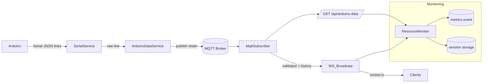

# Arduino Telemetry & Monitoring API

     

Lightweight TypeScript/Express backend that ingests real‑time Arduino sensor data over Serial, republishes it over MQTT and WebSockets, exposes HTTP endpoints for polling clients, and provides deep runtime resource monitoring (CPU, memory, event loop, throughput) with session recording.

> 🧪 Designed to compare resource cost of WebSocket streaming vs HTTP polling under controlled sessions.

---

## Table of Contents

1. [Overview](#overview)
2. [Features](#features)
3. [Preview](#preview)
4. [High‑Level Architecture](#high-level-architecture)
5. [Data Flow](#data-flow)
6. [Tech Stack](#tech-stack)
7. [Environment Variables](#environment-variables)
8. [Project Structure](#project-structure)
9. [Endpoints](#endpoints)
10. [Monitoring & Sessions](#monitoring--sessions)
11. [MQTT Integration](#mqtt-integration)
12. [Serial Layer](#serial-layer)
13. [Docker](#docker)
14. [Local Development](#local-development)
15. [Testing](#testing)
16. [Security Notes](#security-notes)
17. [Troubleshooting](#troubleshooting)
18. [License](#license)
19. [Benchmarks & Measurement](#benchmarks--measurement)

---

## Overview

The service continuously reads raw JSON telemetry lines from an Arduino via a configured serial port. Each fresh reading is:

1. Published to an MQTT topic (retain flag) for decoupled consumers.
2. Stored in in‑memory history (bounded) and broadcast to WebSocket clients.
3. Exposed via a lightweight HTTP polling endpoint (`/api/arduino-data`).
4. Accounted for in a resource & traffic monitor providing system metrics and session recording for performance analysis (useful for comparing WebSocket vs HTTP polling cost).

---

## Features

| Domain | Capability |
| --- | --- |
| Serial Ingestion | Continuous line‑based parsing via `serialport` + newline parser |
| Data Validation | Runtime type guard for Arduino payload shape |
| MQTT Publish | Retained message on configurable topic for late subscribers |
| WebSockets | Socket.IO broadcast of latest composite payload (current + history) |
| HTTP Polling | `/api/arduino-data` returns latest dataset (stringified) |
| Resource Monitoring | CPU, memory, ELU, event loop delay percentiles, client counts, traffic rates |
| Session Recording | Start/stop measurement sessions (ws or polling mode) with captured per‑second samples |
| Internal Driver | Deterministic self‑poller for reproducible HTTP load during polling sessions |
| Rate Limiting | General + strict limiters ready for sensitive routes |
| Security Headers | Conditional production hardening with Helmet |
| Error Handling | Centralized structured error responses + custom errors |

---

## Preview

Szybkie sprawdzenie działania:

- WebSocket: subskrybuj eventy `arduinoData` i `metrics` przez Socket.IO (domyślnie pod `ws://localhost:5000`).
- HTTP: wywołaj `/api/arduino-data` aby pobrać ostatni zestaw danych (JSON).
- Sesje: rozpocznij `POST /api/monitor/start` z `{ "label":"Test", "mode":"ws" }`.

Przykłady można uruchomić lokalnie (curl/WS) albo przez testy integracyjne.

## High-Level Architecture



---

## Data Flow

1. Arduino emits a line (newline terminated) JSON (includes potentiometer, temperature etc.).
2. `SerialService` captures and stores the latest raw line.
3. Every ~1 s `ArduinoDataService.process()` fetches the latest line and publishes via MQTT (retain).
4. Separate `MqttSubscriber` (also subscribed to the retained topic) validates, enriches (timestamp), appends to history (capped to 1000, history excludes the current point), and emits via Socket.IO (`arduinoData`) when live emissions are enabled.
5. HTTP clients can poll `/api/arduino-data` for the latest composite object.
6. `ResourceMonitorService` samples CPU/memory/event loop & traffic counters each second, streaming metrics via `metrics` WebSocket event and optionally recording into sessions (ws or polling modes).

Notes:

- Placeholder/non‑JSON lines (e.g., the string `Brak danych`) are filtered out early and never published nor emitted.
- Real‑time WebSocket emissions (`arduinoData`, `metrics`) are controlled by `LIVE_EMIT_ENABLED` (alias: `LIVE_REALTIME_ENABLED`) and can be toggled at runtime via `/api/monitor/live-emit`.

---

## Tech Stack

| Layer      | Tech                                                    |
| ---------- | ------------------------------------------------------- |
| Runtime    | Node.js 20+                                             |
| Framework  | Express 4 (TypeScript)                                  |
| Realtime   | Socket.IO Server                                        |
| Serial     | serialport + @serialport/parser-readline                |
| Messaging  | MQTT (via `mqtt` lib)                                   |
| Monitoring | pidusage, perf_hooks (ELU & event loop delay histogram) |
| Security   | Helmet, rate limiting, CORS                             |
| Tooling    | TypeScript, ESLint, Prettier, Jest                      |
| Container  | Multi‑stage Dockerfile (alpine)                         |

---

## Environment Variables

Create `.env` (required at runtime):

```bash
PORT=5000                 # API listening port
NODE_ENV=development      # or production
SERIAL_PORT=/dev/ttyUSB0  # Arduino serial device path
BAUD_RATE=9600            # Must match Arduino sketch
MQTT_BROKER=mqtt://localhost:1883
MQTT_TOPIC=arduino/sensordata
SELF_POLL_URL=http://localhost:5000/api/arduino-data  # optional override for internal polling
LIVE_EMIT_ENABLED=1        # 1 to emit WS 'arduinoData' & 'metrics', 0 to disable (alias: LIVE_REALTIME_ENABLED)
```

All are mandatory except `SELF_POLL_URL`. Missing keys throw early (`config/config.ts`).

---

## Project Structure

```text
src/
  app.ts                  # Entry point / server bootstrap
  server.ts               # Express + Socket.IO wiring & periodic processing
  config/config.ts        # Env variable loader & validation
  controllers/            # HTTP controllers
  routes/                 # Express route definitions
  services/               # Serial, MQTT, monitoring & data processing
  providers/              # WebSockets initialization
  middlewares/            # Error, CORS handlers
  rateLimiters/           # General / strict rate limiting configs
  errors/                 # Custom error hierarchy
  __tests__/              # Jest tests
  public/                 # Static assets (served under /api/public)
  Dockerfile              # Multi-stage container build
```

---

## Endpoints

### Arduino Data

| Method | Path | Description | Response |
| --- | --- | --- | --- |
| GET | `/api/arduino-data` | Latest composite telemetry (lastMeasurement + history) | `{ success, data }` (string payload inside data) |

`data` is a JSON string representing:

```json
{
  "lastMeasurement": { "potValue": 123, "temperature": 21.5, "timestamp": "2025-08-08T11:21:00.000Z" },
  "history": [ { "potValue": 120, "temperature": 21.4, "timestamp": "..." } ]
}
```

Semantics:

- `history` intentionally does NOT include the current `lastMeasurement` point. This keeps delta/derivative views on the client meaningful and avoids double‑counting.

Arduino payload shape (per line before enrichment):

```json
{
  "potValue": 512,
  "voltagePot": 2.5,
  "lm35Value": 123,
  "voltageLM35": 0.62,
  "temperature": 21.7,
  "readingTime": 12,
  "uptimeSec": 345,
  "readingCount": 678
}
```

### Monitoring

| Method | Path | Description |
| --- | --- | --- |
| GET | `/api/monitor/live` | One immediate resource metrics sample |
| POST | `/api/monitor/start` | Start a measurement session (body: `{ label, mode, pollingIntervalMs?, sampleCount?, durationSec?, wsFixedRateHz?, assumedPayloadBytes?, loadCpuPct?, loadWorkers?, clientsHttp?, clientsWs? }`) |
| POST | `/api/monitor/stop` | Stop an active session (body: `{ id }`) |
| POST | `/api/monitor/reset` | Clear all recorded sessions |
| GET | `/api/monitor/sessions` | List sessions (latest first) |
| GET | `/api/monitor/sessions/:id` | Retrieve single session with samples |
| GET | `/api/monitor/live-emit` | Inspect current real‑time emission flag (WS on/off) |
| POST | `/api/monitor/live-emit` | Toggle real‑time emissions: body `{ enabled: boolean }` |
| GET | `/api/monitor/sessions/export/csv` | Export flattened session metrics as CSV |

CSV columns (excerpt): `timestamp, sessionId, mode, httpReqRate, wsMsgRate, bytesPerSec, cpu, rss, elu, evLoopDelayP99, jitterMs, freshnessMs, wsClients`.

### WebSockets Events

| Event | Payload | Description |
| --- | --- | --- |
| `arduinoData` | JSON string (composite) | Broadcast of latest telemetry + bounded history |
| `metrics` | `LiveMetrics` object | Per‑second resource & traffic metrics |

---

## Monitoring & Sessions

`ResourceMonitorService` aggregates:

- CPU (% process) via `pidusage`.
- Memory (RSS, heap segments, external, ArrayBuffers).
- Event Loop Utilization & delay percentiles (p50 / p99 / max).
- Throughput: HTTP request rate, WS message rate, bytes per second, cumulative counters.
- Connected WebSocket client count.
- Inter‑arrival jitter (stdDev of message intervals) and data freshness (ms since last Arduino timestamp).

Sessions (started through `/api/monitor/start`) capture each second’s metrics and optionally self‑generate polling load when `mode === 'polling'`. Useful for comparative analysis of resource usage patterns.

---

## MQTT Integration

- Publish: `MqttService.publishData()` connects, publishes retained message, closes connection.
- Subscribe: `initMqttSubscriber()` maintains a persistent connection, filters placeholders/non‑JSON, validates payloads, enriches with timestamp, accumulates bounded history (1000 entries), emits via WebSockets (if live emit is enabled), and updates resource metrics counters with WS bytes.

Broker independence allows external tooling (e.g. mosquitto) for persistence or bridging.

---

## Serial Layer

`SerialService` opens the configured serial port once and maintains the latest line (trimmed). Errors are logged; consumers read a snapshot via `getLatestData()`. The reading loop is event driven (no polling) thanks to the parser stream.

---

## Docker

Multi‑stage `Dockerfile` (alpine):

| Stage   | Purpose                                   |
| ------- | ----------------------------------------- |
| base    | Runtime base (Node 22 alpine)             |
| deps    | Production dependencies (cache)           |
| builder | Full install + TypeScript build (`dist/`) |
| runner  | Minimal production image (non‑root user)  |

Build & run (example):

```bash
docker build -t arduino-api ./src
docker run --rm -p 5000:5000 \
  -e PORT=5000 \
  -e NODE_ENV=production \
  -e SERIAL_PORT=/dev/ttyUSB0 \
  -e BAUD_RATE=9600 \
  -e MQTT_BROKER=mqtt://host.docker.internal:1883 \
  -e MQTT_TOPIC=arduino/sensordata \
  arduino-api
```

> Adjust `SERIAL_PORT` mapping if passing a real device into the container (may require `--device`).

To start with real‑time emissions disabled by default, set `LIVE_EMIT_ENABLED=0` (or `LIVE_REALTIME_ENABLED=0`) in the environment.

---

## Local Development

```bash
yarn install
# create .env with required vars (see above)
yarn dev               # nodemon + ts-node

# or run tests in watch mode
yarn test:watch
```

Serial & MQTT must be reachable locally; for test mocks you can temporarily stub `SerialService` or run a local MQTT broker (e.g. `mosquitto`).

---

## Testing

Jest test entry: `__tests__/app.test.ts` (extend with additional service/controller tests).

Commands:

```bash
yarn test           # run once
yarn test:watch     # watch mode
yarn test:coverage  # coverage report
```

Recommended additional test areas:

- Payload validation & error paths in `MqttSubscriber`.
- Session start/stop edge cases.
- Rate limiter behaviours.

---

## Benchmarks & Measurement

This project includes a simple but reproducible measurement pipeline to compare WS vs HTTP polling:

- Run a full measurement suite (creates artifacts under `benchmarks/<timestamp>/`):
  - `yarn measure`
  - One-command full matrix: `npm run bench:main` (WS/HTTP; Hz: 0.5,1,2,5; load: 0,25,50; clients: 0,10,25,50; tick: 200 ms). After it finishes:
    - docs auto-update the research file (`docs/ASPEKT_BADAWCZY.md`)
    - all-runs aggregates are written to `benchmarks/_aggregate.csv` and `benchmarks/_aggregate.json` (also `benchmarks/combined.csv`)
- Artifacts per run:
  - `sessions.csv` — flattened per‑second samples for both modes
  - `summary.json` — aggregated metrics (avg rates, bytes/unit, EL delay p99, jitter, freshness)
  - `README.md` — human‑readable summary mapped to the dashboard views
- Update the research document (inject latest results into `docs/ASPEKT_BADAWCZY.md`):
  - `yarn docs:research:update`
  - Open the consolidated results quickly: `npm run results:open`

Notes:

- To reduce noise during measurements, temporarily disable live emissions with `LIVE_EMIT_ENABLED=0` or via `POST /api/monitor/live-emit`.
- Intervals and tolerances are configurable in the measurement script (`src/scripts/measurementRunner.ts`).
- Opcjonalny generator obciążenia CPU na czas sesji: `loadCpuPct` (0..100) i `loadWorkers` (1..8). W runnerze można też użyć env `MEASURE_LOAD_PCT`, `MEASURE_LOAD_WORKERS`.
- Symulacja liczby klientów w sesji: `clientsHttp` (N równoległych wewnętrznych pollerów) oraz `clientsWs` (N syntetycznych klientów Socket.IO podłączonych do własnego serwera). Uwaga: `clientsWs` wymaga aby API było uruchomione i wystawiało Socket.IO pod `SELF_WS_URL` (domyślnie <http://localhost:5000>).
  - Note: The Arduino sketch typically emits ~1 Hz. Rates >1–2 Hz test transport capacity and server load rather than data freshness. Use Staleness [ms] to interpret freshness.
- W measurementRunner dostępne są dodatkowe flagi środowiskowe:
  - `MEASURE_LOAD_SET` np. `0,25,50` — uruchamia komplet przebiegów dla wielu poziomów obciążenia CPU,
  - `MEASURE_CLIENTS_HTTP` — liczba syntetycznych klientów HTTP,
  - `MEASURE_CLIENTS_WS` — liczba syntetycznych klientów WS.

---

---

## Security Notes

- Helmet only active in production (`NODE_ENV=production`).
- Rate limiting configurable; tighten for public deployments.
- CORS presently allows `origin: true` (reflects requester) – restrict for hardened environments.
- Non‑privileged user in final Docker stage reduces container risk.

---

## Troubleshooting

| Symptom | Possible Cause | Action |
| --- | --- | --- |
| No serial data | Wrong `SERIAL_PORT` or permissions | Confirm device path / add udev rules / run with proper group |
| Empty MQTT topic | Broker unreachable | Verify `MQTT_BROKER`, network, authentication |
| High CPU | Extremely fast polling session | Increase `pollingIntervalMs` or switch to WS mode |
| History not growing | Invalid JSON payload | Check Arduino sketch output / validation errors in logs |

---

## License

Add license information (e.g. MIT) here.

---

## Contributing

Issues & PRs welcome. Please run `yarn format` before submitting.

---

### Quick Reference

```bash
# Dev
yarn dev

# Build
yarn build

# Start (compiled)
node dist/src/app.js

# Tests
yarn test

# Docker
docker build -t arduino-api ./src && docker run -p 5000:5000 arduino-api
```

---

Made for real‑time IoT experimentation & performance analysis.
