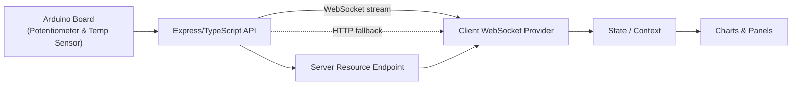

# Real‑Time Arduino Telemetry Dashboard

      

Monitor live Arduino sensor readings (potentiometer value & temperature) and server resource usage in a rich, responsive web UI. Built with Next.js 15 App Router, Material UI, ApexCharts and powered by WebSockets (with HTTP polling fallback). Packaged & deployable via Docker.

> ⚡ Dual transport (WebSocket + HTTP polling fallback) enables comparative performance & resource analysis.

---

## Table of Contents

1. [Overview](#overview)
2. [Preview](#preview)
3. [Features](#features)
4. [Architecture & Data Flow](#architecture--data-flow)
5. [Technology Stack](#technology-stack)
6. [Project Structure](#project-structure-excerpt)
7. [Environment Variables](#environment-variables)
8. [Getting Started (Development)](#getting-started-development)
9. [Running in Docker](#running-in-docker)
10. [Runtime Modes: WebSocket vs Polling](#runtime-modes-websocket-vs-polling)
11. [Available Scripts](#available-scripts)
12. [Quality & Performance Considerations](#quality--performance-considerations)
13. [License](#license)
14. [Support / Questions](#support--questions)

---

## Overview

This client application visualizes telemetry provided by an external Express/TypeScript API that aggregates live data coming from an Arduino device:

- Potentiometer value (analog input)
- Temperature sensor reading
- Server resource utilization (CPU / Memory etc.)

The UI updates in near real time through a WebSocket connection. If a persistent socket cannot be established, a graceful degradation mechanism can fall back to periodic HTTP polling (configurable). Interactive line / area charts and status panels give immediate insight into current trends and instantaneous values.

Use cases:

- Educational / thesis project for embedded ↔ cloud integration
- Lightweight operational monitoring of a prototype hardware setup
- Demonstration of real‑time data streaming in a modern Next.js application

---

## Preview

Krótki podgląd działania aplikacji i kluczowych elementów interfejsu (wskaźnik połączenia, wybór trybu pracy, wykresy i panele KPI).

## Features

| Category        | Highlights                                                                        |
| --------------- | --------------------------------------------------------------------------------- |
| Real‑Time Data  | WebSocket streaming (Socket.IO client) with auto‑reconnect                        |
| Resilience      | Fallback HTTP polling strategy to maintain visibility                             |
| Visualization   | ApexCharts for smooth, responsive time‑series & gauge‑style charts                |
| UI/UX           | Material UI (MUI v7) theming + responsive layout + dark‑mode readiness            |
| Performance     | Next.js 15 App Router + Turbopack dev mode + modularized imports for tree‑shaking |
| Type Safety     | Full TypeScript types for Arduino payloads & monitoring data                      |
| Deployment      | Containerized with Docker for reproducible builds                                 |
| Configurability | Single `.env.local` variable to target different API / WS endpoints               |

---

## Architecture & Data Flow



Key components:

- `websocket/providers/websocket-provider.tsx` – Manages socket lifecycle & exposes context.
- `sections/home/*` – Feature‑oriented UI sections (charts, status, resource monitor).
- `types/*` – Shared domain models for telemetry and monitoring payloads.

---

## Technology Stack

| Layer     | Tools                                          |
| --------- | ---------------------------------------------- |
| Framework | Next.js 15 (App Router, React 19)              |
| UI        | Material UI v7, Emotion                        |
| Charts    | ApexCharts + react-apexcharts                  |
| Realtime  | Socket.IO client (WebSockets)                  |
| Language  | TypeScript 5                                   |
| Packaging | Docker                                         |
| Tooling   | ESLint 9, Turbopack (dev), modularized imports |

---

## Project Structure (excerpt)

```text
client/
  src/
    app/                 # Next.js App Router entrypoints
    sections/home/       # Dashboard feature sections & components
    types/               # Shared TypeScript domain types
    websocket/providers/ # WebSocket context provider
    theme.ts             # MUI theme configuration
```

---

## Environment Variables

Create a `.env.local` in the project root (never commit secrets):

```bash
NEXT_PUBLIC_WS_URL=ws://localhost:5000   # WebSocket base URL exposed to the browser
NEXT_PUBLIC_API_BASE=http://localhost:5000 # Optional: HTTP base (polling, toggles, CSV export)
```

Notes:

- Must start with `NEXT_PUBLIC_` to be available client‑side.
- If not provided, `NEXT_PUBLIC_API_BASE` defaults to `http://localhost:5000` in code.

An example file is provided as `.env.local.example`.

---

## Getting Started (Development)

```bash
# 1. Install dependencies
yarn install

# 2. Provide environment config
cp .env.local.example .env.local   # then adjust if needed

# 3. Start dev server (Turbopack)
yarn dev

# 4. Open the dashboard
http://localhost:3000
```

Hot reloading & fast refresh are enabled. Ensure the external Express API + WebSocket server is running (default assumed at `localhost:5000`).

---

## Running in Docker

Build and run the client container (example):

```bash
# Build image
docker build -t arduino-dashboard-client .

# Run container (expose port 3000, pass env var)
docker run --rm -p 3000:3000 \
  -e NEXT_PUBLIC_WS_URL=ws://host.docker.internal:5000 \
  arduino-dashboard-client
```

Then visit: <http://localhost:3000>

If orchestrating with docker‑compose, ensure network aliasing allows the client to resolve the API/WebSocket host (handled automatically in the provided unified compose file at repository root).

```bash
docker compose up --build
docker compose down
```

### Unified docker-compose (root)

Use repository root `docker-compose.yml` to start Client + API + Mosquitto broker:

```bash
docker compose up --build
```

Navigate to <http://localhost:3000>. WebSocket endpoint is reachable at service name `arduino-api:5000` internally (`NEXT_PUBLIC_WS_URL` preset in compose).

### Bridge mode (Windows)

When running on Windows without passing the USB device into containers, use the Serial Bridge from the repository (see `docs/serial-bridge.md`). The client requires no changes; the API will receive data via MQTT. Use the unified docker‑compose at the repo root and run the bridge on the host.

For step‑by‑step scenarios (Docker vs Bridge vs Local Dev) see the root `README.md`.

---

## Runtime Modes: WebSocket vs Polling

| Mode         | Trigger                                    | Pros                             | Trade‑offs                    |
| ------------ | ------------------------------------------ | -------------------------------- | ----------------------------- |
| WebSocket    | Default attempt on load                    | Low latency, push updates        | Requires stable socket path   |
| HTTP Polling | Automatic fallback (e.g. connection error) | Works behind restrictive proxies | Higher latency, more overhead |

Connection status indicators & retry logic are handled by the WebSocket provider (`src/websocket/providers/websocket-provider.tsx`) and surfaced in UI components.

### Live emit toggle (test mode)

To minimize runtime noise during measurements/tests you can disable real‑time WebSocket emissions at the server. The dashboard exposes a toggle that calls:

- GET `/api/monitor/live-emit` – read current state
- POST `/api/monitor/live-emit` – set `{ enabled: boolean }`

You can also start the server with emissions disabled via env `LIVE_EMIT_ENABLED=0` (alias: `LIVE_REALTIME_ENABLED=0`).

---

---

## Available Scripts

| Script          | Description                                  |
| --------------- | -------------------------------------------- |
| `yarn dev`      | Start dev server with Turbopack at port 3000 |
| `yarn build`    | Production build (outputs to `.next`)        |
| `yarn start`    | Run production server (after build)          |
| `yarn lint`     | Lint all source files                        |
| `yarn lint:fix` | Lint & auto‑fix where possible               |

Production run (without Docker):

```bash
yarn build
yarn start
# => http://localhost:3000
```

---

## Quality & Performance Considerations

- Modularized imports for MUI & lodash reduce bundle size.
- WebSocket payloads typed to avoid runtime shape errors.
- ApexCharts configuration tuned for live streaming (animations & smooth transitions).
- Single source of truth for telemetry via context provider avoids prop drilling.

---

> ℹ️ Internationalization (i18n) is intentionally not implemented at this time.

---

## License

Add licensing information (e.g., MIT) here.

---

## Support / Questions

Open an issue or start a discussion if you have suggestions or run into a problem. Contributions & constructive feedback are welcome.

---

### ✅ Quick Reference

```bash
# Dev
yarn dev

# Build & start
yarn build && yarn start

# Docker (example)
docker build -t arduino-dashboard-client .
docker run -p 3000:3000 -e NEXT_PUBLIC_WS_URL=ws://host.docker.internal:5000 arduino-dashboard-client

# Unified stack
docker compose up --build
```

---
