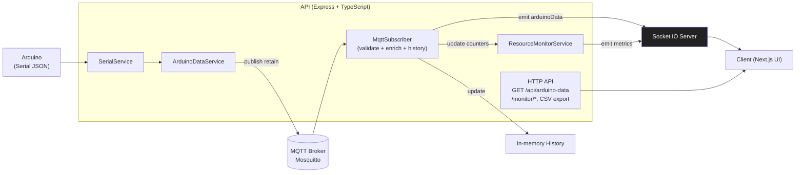
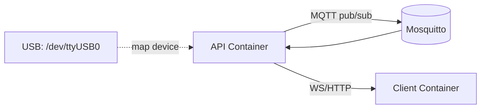
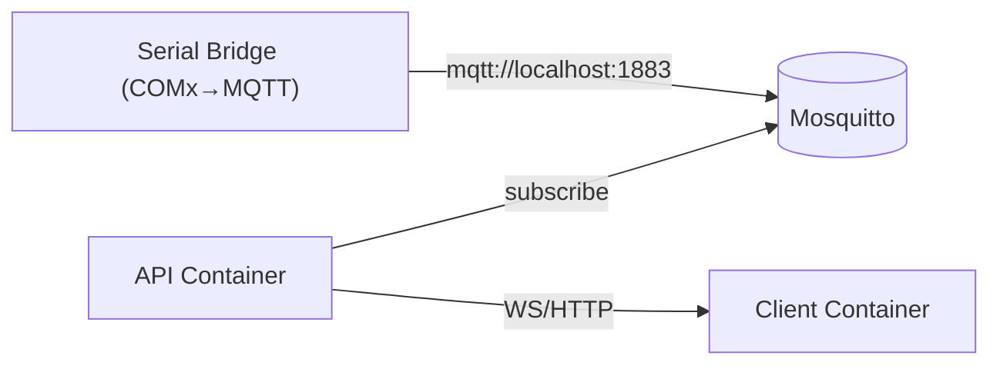
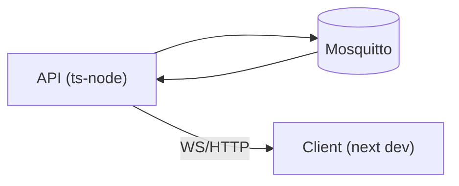
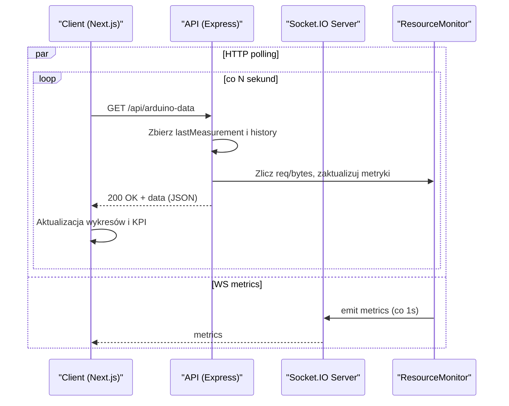
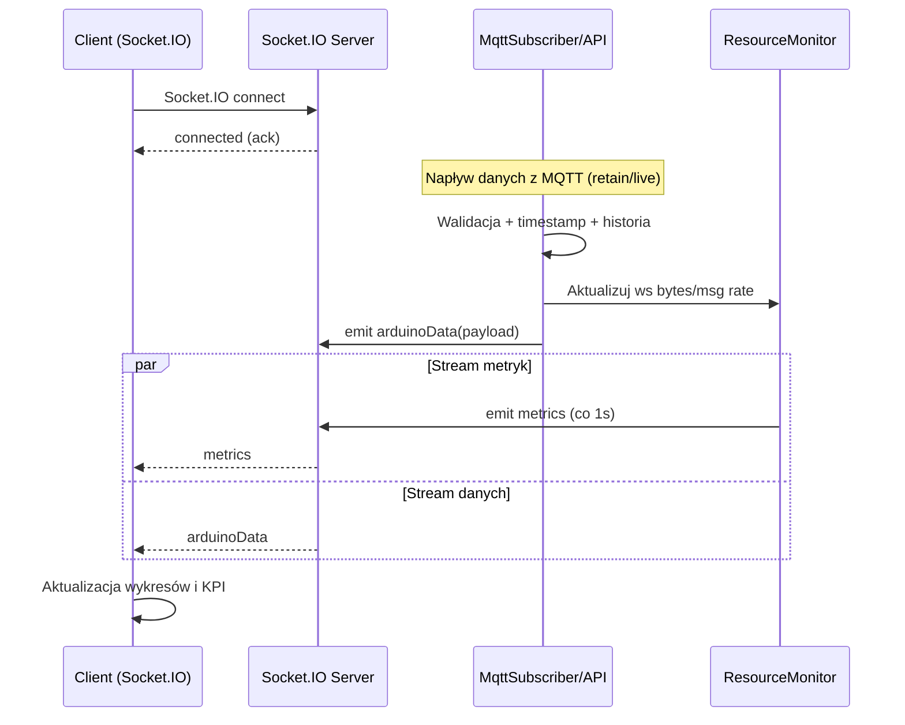

# Architektura i Zasada Działania Systemu

## 1. Cel systemu

System realizuje akwizycję danych sensorycznych z Arduino, ich ujednolicenie w formacie JSON, dystrybucję przez MQTT oraz prezentację i analizę w aplikacji web (Next.js) z natychmiastową aktualizacją (WebSocket). Dodatkowo zapewnia moduł eksperymentalny do porównania trybów transmisji (push vs polling) oraz monitorowanie zużycia zasobów procesu backend.

## 2. Warstwy i komponenty

| Komponent               | Technologia                                       | Rola                                                                    | Interfejsy                           |
| ----------------------- | ------------------------------------------------- | ----------------------------------------------------------------------- | ------------------------------------ |
| Arduino                 | C++ / PlatformIO                                  | Generacja surowych pomiarów                                             | Linia szeregowa (USB)                |
| Serial Bridge (Windows) | Node.js (serialport, mqtt)                        | Most COM→MQTT gdy brak dostępu USB w kontenerze                         | MQTT publish (`arduino/sensordata`)  |
| API Backend             | Node.js (Express, Socket.IO, MQTT.js, TypeScript) | Walidacja, publikacja, subskrypcja, monitor zasobów, agregacja historii | HTTP REST, WebSocket, MQTT subscribe |
| Broker MQTT             | Eclipse Mosquitto                                 | Pub/Sub transport                                                       | TCP 1883                             |
| Client (UI)             | Next.js                                           | Wizualizacja, inicjacja sesji pomiarowych                               | HTTP (fetch), WebSocket              |
| Resource Monitor        | perf_hooks + pidusage                             | Pomiar CPU, pamięci, opóźnień pętli zdarzeń                             | Emituje event `metrics` (WS)         |

## 3. Przepływ danych

1. Arduino generuje linię JSON zakończoną `\n` (lub tekst zastępczy jeśli brak danych).
2. Bridge (lub SerialService w Linux) czyta linie, waliduje JSON, publikuje do MQTT (`arduino/sensordata`).
3. API:
   - subskrybuje topic i aktualizuje ostatnią próbkę + historię (w pamięci),

- periodicznie (co ~1 s) publikuje metryki i może retransmitować dane (zależnie od konfiguracji),
- emituje dane do klientów przez Socket.IO event `arduinoData`.

1. UI odbiera eventy i aktualizuje wykresy / komponenty.
2. Resource Monitor co sekundę oblicza metryki i wysyła event `metrics`.

### 3.1 Diagram przepływu (Mermaid)



### 3.2 Warianty uruchomienia

#### 3.2.1 Linux/WSL2 (Docker)

- USB urządzenie mapowane do kontenera API (np. `/dev/ttyUSB0`).
- API publikuje/subskrybuje MQTT (Mosquitto w sieci dockerowej) i serwuje WS/HTTP do klienta.



#### 3.2.2 Windows + Serial Bridge

- Mostek COM→MQTT działa na hoście Windows i publikuje do lokalnego Mosquitto.
- Kontener API subskrybuje dane z brokera i wystawia WS/HTTP dla klienta.



#### 3.2.3 Lokalny development

- Uruchom API w ts-node i klienta w `next dev`; broker lokalnie.



## 4. Format danych sensorycznych

Przykładowy pakiet JSON (minimalny kontrakt):

```json
{
	"potValue": 512,
	"voltagePot": 2.5,
	"lm35Value": 150,
	"voltageLM35": 1.5,
	"temperature": 30.0,
	"readingTime": 2,
	"uptimeSec": 1234,
	"readingCount": 678
}
```

Uwaga:

- Arduino publikuje pojedynczy odczyt (jak powyżej) w każdej linii JSON.
- Backend dodaje znacznik czasu i opakowuje dane w payload dla klientów:

```json
{
	"lastMeasurement": {
		"potValue": 512,
		"voltagePot": 2.5,
		"lm35Value": 150,
		"voltageLM35": 1.5,
		"temperature": 30.0,
		"readingTime": 2,
		"uptimeSec": 1234,
		"readingCount": 678,
		"timestamp": "2025-08-09T12:34:56.789Z"
	},
	"history": [
		{
			"potValue": 508,
			"voltagePot": 2.48,
			"lm35Value": 148,
			"voltageLM35": 1.48,
			"temperature": 29.6,
			"readingTime": 2,
			"uptimeSec": 1232,
			"readingCount": 677,
			"timestamp": "2025-08-09T12:34:54.789Z"
		}
	]
}
```

Wymagania:

- Każda linia osobny obiekt JSON.
- Wymagane pole czasowe (np. `ts` w ms) lub wstawiane przez backend jeśli brak.
- Brak komentarzy / przecinków końcowych.

## 5. Mechanizmy odporności i niezawodności

| Mechanizm               | Cel                                     | Implementacja                          |
| ----------------------- | --------------------------------------- | -------------------------------------- |
| Retry / backoff serial  | Odporność na chwilową utratę urządzenia | SerialService z opóźnieniami rosnącymi |
| Filtrowanie nie-JSON    | Brak spamowania logów błędami           | Walidacja linii w bridge i backendzie  |
| Health endpoint         | Szybka diagnoza                         | `/health` zwraca status i `serialOpen` |
| Graceful shutdown       | Spójne zamknięcie zasobów               | Obsługa sygnałów + zamykanie serwerów  |
| KeepAlive HTTP internal | Stabilne polling sessions               | Agent keep-alive w ResourceMonitor     |
| Unref timerów           | Nieblokowanie wychodzenia procesu       | `unref()` na interwałach               |

## 6. Tryby pozyskiwania danych przez klienta (aspekt badawczy)

System umożliwia porównanie dwóch strategii odbioru danych:

| Tryb             | Opis                                         | Zalety                                               | Wady                                                  | Oczekiwane zużycie zasobów                                              |
| ---------------- | -------------------------------------------- | ---------------------------------------------------- | ----------------------------------------------------- | ----------------------------------------------------------------------- |
| WebSocket (push) | Serwer emituje dane po przyjściu próbki      | Najmniejsze opóźnienia, mniej narzutowych pakietów   | Utrzymane połączenie, heartbeat                       | Niższe CPU przy niskiej liczbie klientów, stały koszt utrzymania gniazd |
| HTTP Polling     | Klient odpyta cyklicznie `/api/arduino-data` | Proste, brak stanu na serwerze (po stronie socketów) | Wyższe opóźnienia, mnoży żądania przy wielu klientach | CPU i I/O rosną liniowo z (klienci \* częstotliwość)                    |

### 6.1 Sekwencja: HTTP Polling



### 6.2 Sekwencja: WebSocket (Socket.IO)



## 7. Moduł pomiarowy ResourceMonitor

Metryki generowane co 1s:

- `cpu` – procent CPU procesu (średnia z krótkiego interwału pidusage)
- `rssMB`, `heapUsedMB`, `heapTotalMB`, `externalMB`, `arrayBuffersMB`
- Event Loop Delay percentyle: `elDelayP50Ms`, `elDelayP99Ms`, `elDelayMaxMs`
- `elu` – Event Loop Utilization (0..1)
- Raty: `httpReqRate`, `wsMsgRate`, `httpBytesRate`, `wsBytesRate`
- Kumulacje: `totalHttpRequests`, `totalWsMessages`, `totalHttpBytes`, `totalWsBytes`
- `wsClients` – aktualna liczba klientów
- `loadAvg1` – 1-min load (Linux)
- `uptimeSec` – uptime procesu

Sesje pomiarowe:

- Start: `POST /api/monitor/start` body `{ label, mode: 'ws'|'polling', pollingIntervalMs?, sampleCount?, durationSec?, wsFixedRateHz?, assumedPayloadBytes?, loadCpuPct?, loadWorkers?, clientsHttp?, clientsWs? }`
- Przechowują kolejne próbki metryk w pamięci.
- Można zakończyć `POST /api/monitor/stop` lub automatycznie po `sampleCount`/`durationSec`.

## 8. Metodologia porównania

### 8.1 Cel

Porównać wpływ strategii dostarczania danych (WebSocket vs HTTP Polling) na:

- Zużycie CPU i pamięci procesu backend
- Obciążenie pętli zdarzeń (ELU + opóźnienia)
- Liczbę i wielkość pakietów (HTTP vs WS)
- Skalowalność przy rosnącej liczbie klientów

### 8.2 Scenariusze eksperymentalne

| ID  | Opis                            | Parametry                                    |
| --- | ------------------------------- | -------------------------------------------- |
| S1  | WebSocket – 1 klient            | 1 klient, push naturalny (co ~2s publikacja) |
| S2  | WebSocket – N klientów          | 10 / 25 / 50 klientów równolegle             |
| S3  | Polling – 1 klient              | `pollingIntervalMs=1000`                     |
| S4  | Polling – N klientów            | 10 / 25 / 50 klientów, interval 1000 ms      |
| S5  | Polling High Frequency          | 10 klientów, interval 250 ms                 |
| S6  | Mieszany (50% WS / 50% Polling) | N=20 total                                   |

### 8.3 Metryki zbierane

Z każdej sesji: średnia, mediana, P95 dla: `cpu`, `rssMB`, `elu`, `elDelayP99Ms`, `httpReqRate`, `wsMsgRate`, `httpBytesRate`, `wsBytesRate`.

### 8.4 Procedura

1. Uruchom system w trybie kontrolowanym (stabilne dane wejściowe Arduino – np. generator lub powtarzalny zestaw odczytów).
2. Wyczyść poprzednie sesje: `POST /api/monitor/reset`.
3. Uruchom sesję: `POST /api/monitor/start` z odpowiednią konfiguracją.
4. Równolegle wystartuj klienty symulujące (np. mały skrypt Node generujący WS lub HTTP load – patrz sekcja 12).
5. Po upływie zadanego czasu zatrzymaj sesję (lub poczekaj na automatyczne zakończenie).
6. Pobierz dane: `GET /api/monitor/sessions/:id` → eksport do CSV/JSON.
7. Analiza statystyczna (Python / R / Pandas): oblicz charakterystyki.
8. Zwizualizuj wykresy porównawcze (CPU vs liczba klientów, opóźnienie event loop vs tryb, itd.).

### 8.5 Hipotezy (przykładowe)

- H1: WebSocket dla niskich częstotliwości publikacji jest bardziej efektywny CPU niż Polling przy >=5 klientach.
- H2: Polling z interwałem <=250 ms powoduje istotny wzrost opóźnień event loop.
- H3: Różnica w `rssMB` pomiędzy WS a Polling pozostaje marginalna dla <=50 klientów.

### 8.6 Potencjalne zagrożenia poprawności

| Ryzyko                              | Mitigacja                                               |
| ----------------------------------- | ------------------------------------------------------- |
| Zmienność danych sensorycznych      | Ustalony generator lub bufor powtarzalnych próbek       |
| Fluktuacje systemowe (inne procesy) | Dedykowana maszyna / minimalne tło                      |
| Warm-up V8                          | Pomiar po okresie rozgrzewki (np. odrzucić pierwsze 5s) |
| Garbage Collection piki             | Analiza median / P95 zamiast pojedynczych outlierów     |

## 9. Analiza zużycia zasobów – wskaźniki i interpretacja

### 9.1 Wskaźniki pochodne

| Wskaźnik           | Wzór                                 | Interpretacja                                            |
| ------------------ | ------------------------------------ | -------------------------------------------------------- |
| CPU_per_msg_WS     | `cpu / max(wsMsgRate,1)`             | Średnie koszty CPU (%) na jedną wiadomość push           |
| CPU_per_req_HTTP   | `cpu / max(httpReqRate,1)`           | Średnie koszty CPU na jedno żądanie (polling)            |
| Bytes_per_msg_WS   | `wsBytesRate / max(wsMsgRate,1)`     | Średnia wielkość payloadu WS + nagłówki (przybliżenie)   |
| Bytes_per_req_HTTP | `httpBytesRate / max(httpReqRate,1)` | Średni rozmiar odpowiedzi HTTP                           |
| Overhead_ratio_CPU | `CPU_per_req_HTTP / CPU_per_msg_WS`  | Ile razy polling droższy w CPU od push                   |
| EL_Delay_Stress    | `elDelayP99Ms / elDelayP50Ms`        | Wskaźnik przeciążenia pętli (wyższe = gorsza kulturacja) |

### 9.2 Kryteria oceny

- Efektywność: Overhead_ratio_CPU > 2 sugeruje wyraźną przewagę WebSocket.
- Skalowalność: liniowy wzrost `httpReqRate` z liczbą klientów wskazuje na rosnące koszty – szukać punktu załamania (knee) na wykresie CPU vs klienci.
- Stabilność: `elDelayP99Ms` utrzymane < 40 ms przy rosnącym obciążeniu oznacza brak istotnej degradacji responsywności event loop.
- Pamięć: porównanie `rssMB` oraz trendu w czasie – brak dryfu pamięci (memory leak) = wykres plateau po rozgrzewce.

### 9.3 Przykładowa interpretacja (hipotetyczne wartości)

| Tryb          | Klienci | cpu (%) | wsMsgRate | httpReqRate | elDelayP99Ms | CPU_per_unit | Wniosek                                                    |
| ------------- | ------- | ------- | --------- | ----------- | ------------ | ------------ | ---------------------------------------------------------- |
| WS            | 25      | 18      | 12        | 0           | 8            | 1.5 (%/msg)  | Niski koszt jednostkowy                                    |
| Polling 1s    | 25      | 42      | 0         | 25          | 22           | 1.68 (%/req) | Wyższy całkowity CPU                                       |
| Polling 250ms | 25      | 78      | 0         | 100         | 55           | 0.78 (%/req) | Jednostkowo tańszy, ale saturuje CPU i zwiększa opóźnienia |

Uwagi: Pozornie niższy koszt jednostkowy przy bardzo częstym pollingu wynika z większej amortyzacji kosztów stałych, ale absolutny CPU rośnie szybciej i degraduje pętlę zdarzeń.

### 9.4 Rekomendacje

- Dla częstotliwości aktualizacji ≤2 Hz i >5 klientów – preferować WebSocket.
- Polling tylko dla środowisk z ograniczeniami (firewall / brak WS) lub do prostych jednorazowych odczytów.
- Przy wzroście `elDelayP99Ms` > 60 ms rozważyć horyzontalne skalowanie lub obniżenie częstotliwości odpytań.

## 10. Skalowanie i wąskie gardła

| Obszar              | Ograniczenie            | Sposób skalowania                               |
| ------------------- | ----------------------- | ----------------------------------------------- |
| MQTT broker         | Jednowątkowy, I/O bound | Bridge do chmury / klaster / QoS tuning         |
| API (1 proces)      | Pojedynczy event loop   | PM2 / cluster mode / horyzontalny load balancer |
| Pamięć historii     | Trzymana w RAM          | Przeniesienie do Redis / bazy time-series       |
| WebSocket broadcast | O(n) emisja             | Sharding namespaces / adapter Redis             |

## 12. Przykładowe skrypty obciążeniowe (symulacja klientów)

### 12.1 WebSocket klienci (Node)

```js
import { io } from "socket.io-client";
const N = parseInt(process.env.N || "10", 10);
const URL = process.env.URL || "http://localhost:5000";
let received = 0;
for (let i = 0; i < N; i++) {
	const s = io(URL, { transports: ["websocket"] });
	s.on("arduinoData", () => {
		received++;
	});
}
setInterval(() => {
	console.log("WS messages total:", received);
	received = 0;
}, 5000);
```

### 12.2 HTTP Polling klienci

```js
import fetch from "node-fetch";
const N = parseInt(process.env.N || "10", 10);
const INTERVAL = parseInt(process.env.INTERVAL || "1000", 10);
const URL = process.env.URL || "http://localhost:5000/api/arduino-data";
function start() {
	setInterval(async () => {
		try {
			await (await fetch(URL)).json();
		} catch {}
	}, INTERVAL).unref();
}
for (let i = 0; i < N; i++) start();
```

## 13. Podsumowanie

Dokument przedstawia wewnętrzną architekturę, strumień danych, mechanizmy niezawodności, wskaźniki analityczne i metodykę badań porównawczych WebSocket vs HTTP Polling.
